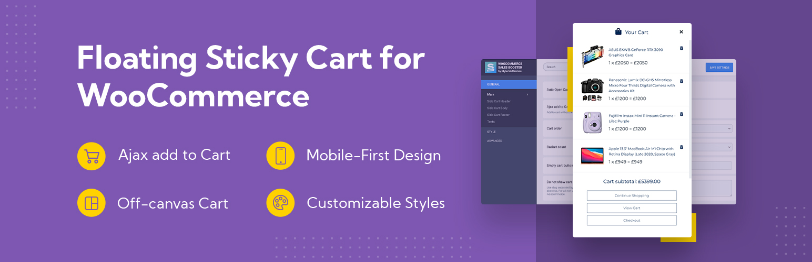

# Floating Sticky Cart for WooCommerce Documentation

**Floating Sticky Cart** is a WooCommerce ajax cart plugin, that allows you to create a side (off-canvas) cart page to improve standard WooCommerce add to cart notice and WooCommerce cart page.

The plugin is built on Ajax (no page reloads) to ensure better conversions, provide frictionless shopping and smooth checkout to boost your shop sales.

A floating cart is added to ensure more leads are generated, and better Facebook pixel warming, which leads to more conversion events and better ad optimization.

Enhance the customer experience and increase your conversion rate with a sliding cart preview that can be accessed from anywhere on your WooCommerce store. No need to take your customers to a separate cart page and reduce conversions by extra unnecessary clicks.

You can customize virtually all visual elements of the side ajax cart page:&#x20;

* Mobile-first design for better conversion rates
* Text string translation to your local language
* View Cart, Checkout, Continue Shopping areas are fully customizable
* Customize cart page width, height, colors, layout, and almost any text/visuals
* Choose how Ajax cart page looks like and easily enable/disable elements you want to show in the cart
* Products sorting order in a cart page
* Disable off-canvas cart and floating cart icon on specific (or even all non-WooCommerce) pages
* Custom CSS stylesheet for extra flexibility.
