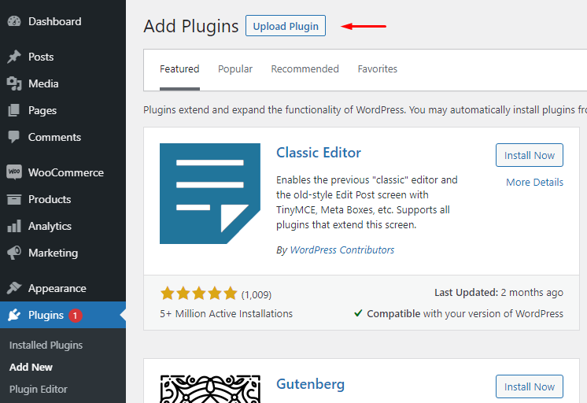
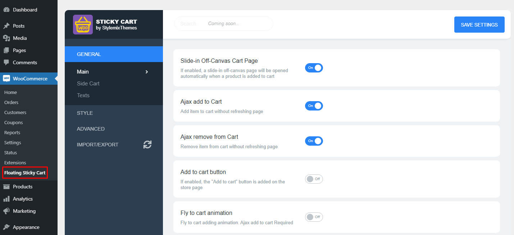

# Plugin Installation

Before you install Floating Sticky Cart for WooCommerce, make sure you've already installed and activated the [WooCommerce plugin for WordPress](https://wordpress.org/plugins/woocommerce/).

After purchase, **download the .zip file** of the plugin from your [WooCommerce account](https://woocommerce.com/signin-with-wordpress/) and save it on your computer.

To install the plugin, go to Dashboard and find the **Plugins** section from the left menu and choose **Add New.**

Afterward, click the **Upload Plugin** button.

&#x20;**Upload** the plugin file and click **Install Now.**

.png>)

The plugin settings will appear in the WooCommerce section:

