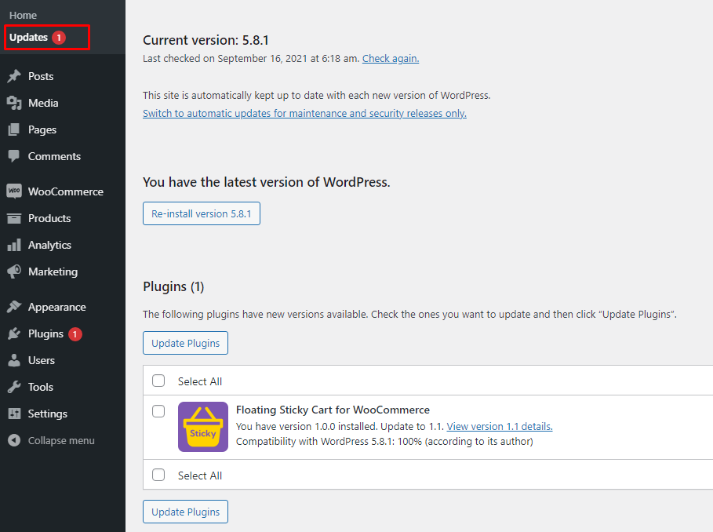
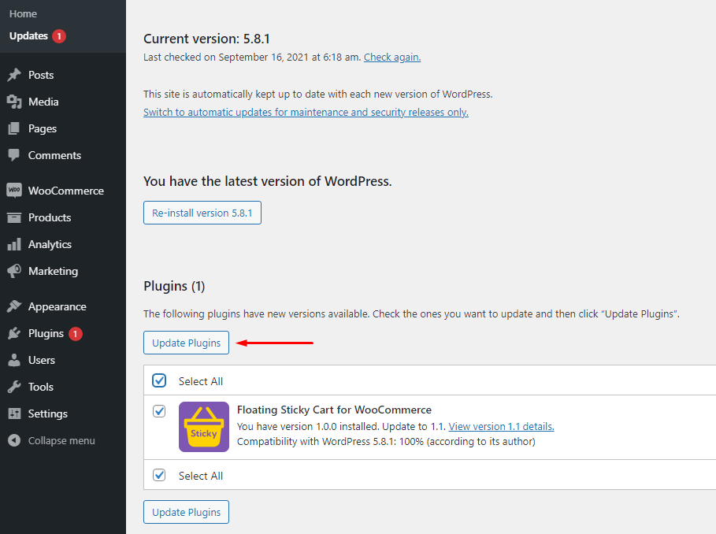
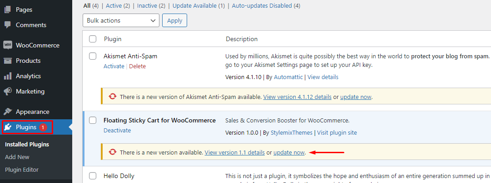

# Update The Plugin

We constantly improve our products and release regular updates. All updates are available for free.

To update the Floating Sticky Cart plugin, go to **Dashboard > Updates**.

In the **Plugins** section find **Floating Sticky Cart**, mark it, and click **Update Plugins**.

Also, you can open **Plugins > Installed Plugins** and update the plugin there. Find **Floating Sticky Cart** from the list and click **Update Now** if there is an update available.

