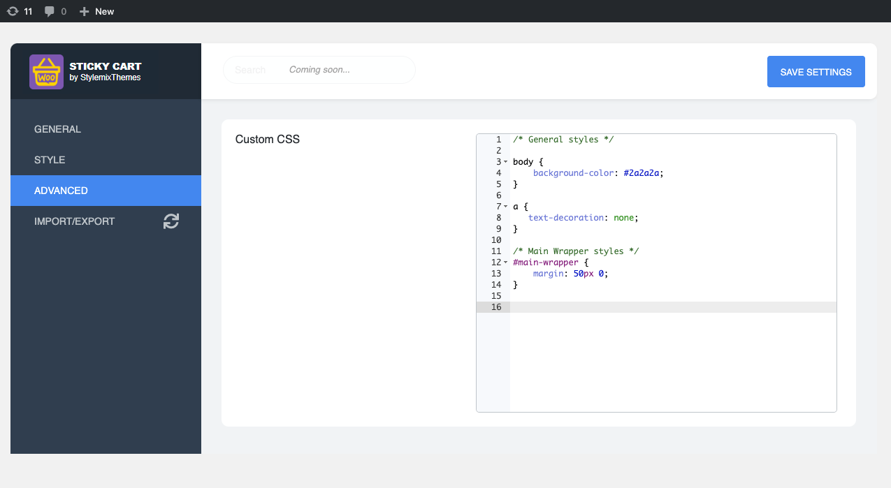

# Advanced

## Custom CSS

The Custom CSS section is similar to WordPress default **Customize > Additional CSS** section. Here you can insert all your custom CSS to overwrite plugin styles without editing any plugin files.

