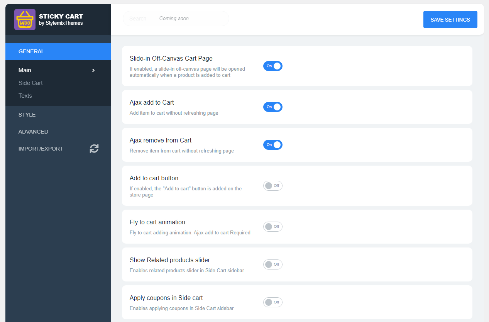
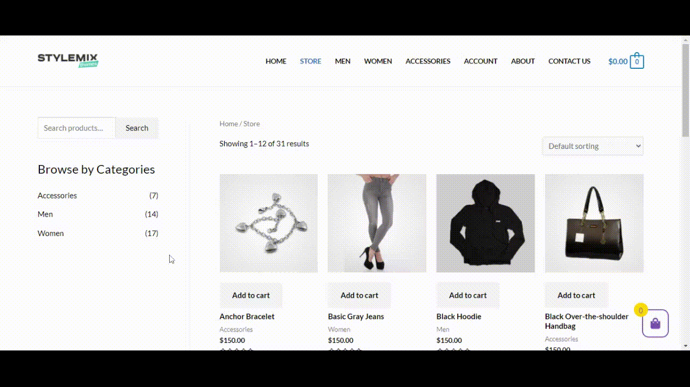
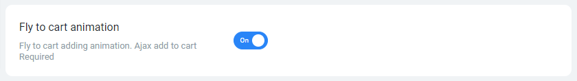
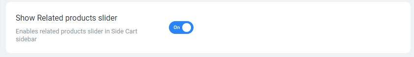
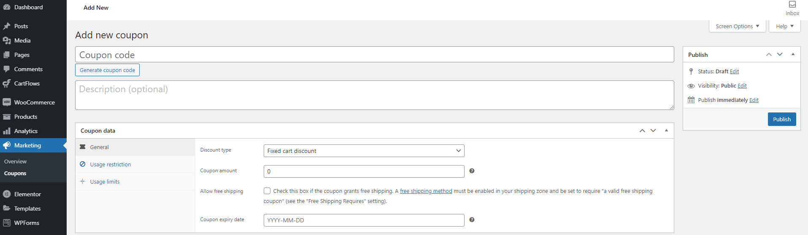
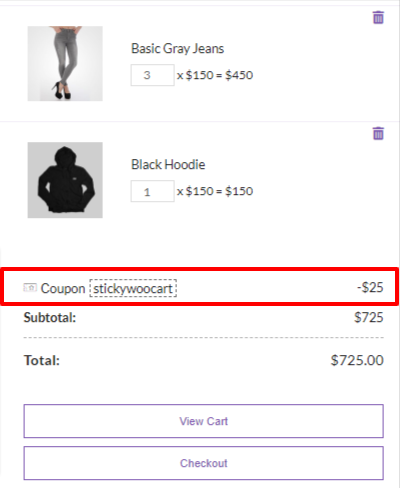
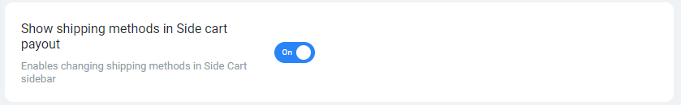

# Main

The **Main** section includes the major plugin settings, such as displaying the Add to cart button and Notifications, Off-canvas settings, and others.

## &#x20; Slide-in Off-Canvas Cart Page

This option allows opening the side cart when adding the product to the cart.

**Enabled Slide-in Off-Canvas Cart Page:**

## Ajax add to Cart

By enabling this option, the item will be added to the cart without refreshing the page.


**AJAX add to cart buttons on archives** option in WooCommerce Settings should be enabled for this option to work properly.


**Enabled Ajax add to Cart:**

## Ajax remove from Cart

This option allows removing items from the cart without refreshing the page.

**Enabled Ajax remove from Cart:**

.gif>)

## Add to cart button

If the theme does not provide a button for adding a product to the cart on the main page of the store, after enabling this option, the plugin will add the **Add to cart** buttons on the store page:

.png>)

.png>)

## Fly to cart animation

When this option is enabled, the **Fly to cart** animation effect activates by adding an item to the cart.


[Ajax add to Cart](main.md#ajax-add-to-cart) option should be enabled for this option to work.


.gif>)

## Show Related products slider

This option allows showing related products to your chosen item. Related items will be displayed as sliders in the cart off-canvas.


Related products will not be displayed if there is only one product in the store and you add it to the cart.


.png>)

## Apply coupons in Side cart

When this option is enabled, you will be able to add different promotion coupons to the items.

After enabling this option, you can create the coupons in **Marketing > Coupons**.

On the opened page, fill in all the required fields and click **Publish** button.


You can get detailed information about the coupon creation process on the [Coupon Management page](https://docs.woocommerce.com/document/coupon-management/) of WooCommerce documentation.


The created promo code appears in the Coupons section.

The coupon will be applied to the selected items.

## Show shipping methods in Side cart payout

By enabling this option, the users can order delivery for their products by specifying the address of their location.

.png>)

By default, the shipping is free of charge, but you can change the shipping price and shipping zones in the WooCommerce settings.


You can get detailed information about the shipping settings on the [Setting up Shipping Zones](https://docs.woocommerce.com/document/setting-up-shipping-zones/) page of WooCommerce documentation.


## Basket status

This setting will define whether to show the basket icon on the web page.

.png>)



If **Always show** option is selected, the basket icon will be visible on the entire website.

.png>)



If **Always hide** option is selected, the basket icon will be hidden on the entire website.


Side Cart automatically opens if the user adds a product to the cart.


.png>)



If **Hide when cart is empty** option is selected, the basket icon will be visible on the entire website when at least 1 product is in the cart.&#x20;

.png>)



## Basket counter status

This setting will define whether to display the counter under the basket icon on the web page.



If **Always show** option is selected, the basket icon counter will be visible on the entire website.


If the **Basket status** option is set to **Always hide**, the counter will be not visible.


.png>)



If **Always hide** option is selected, the basket icon counter will be hidden on the entire website.

.png>)



If **Hide when cart is empty** option is selected, the side cart icon counter will be visible on the entire website when at least 1 product is in the cart.


If the **Basket status** option is set to **Always hide**, the counter will be not visible.


.png>)



## Cart icon Counter

This setting determines whether to count only unique items in the cart or all selected items.

.png>)



If **Total Unique products in a Cart** option is selected, the side cart icon counter showing unique items count in the cart.

.png>)



If **Total items in a Cart** option is selected, the side cart icon counter shows all items count in the cart.

.png>)



## Disable Cart on Selected Pages

.png>)

This setting disables displaying the side cart icon on the selected pages. Page slugs should be written in the field, separated by commas.


Side Cart will be automatically opened if the user adds a product to the cart.

