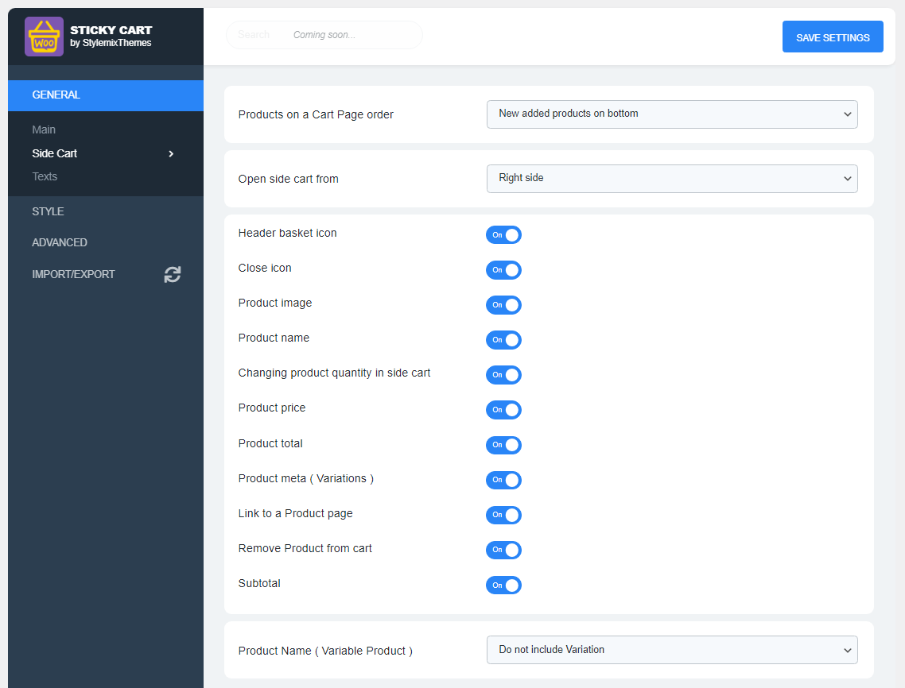
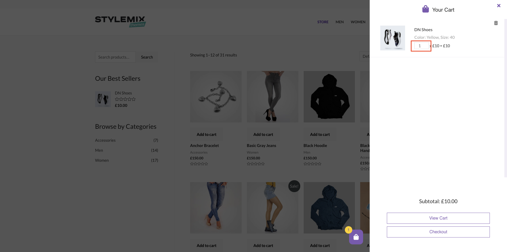

# Side Cart

The Side Cart section includes settings related to the cart, such as: products sequence in the cart, displaying products image or prices in the cart and others.

## Products on a Cart Page order

.png>)

This setting will define whether to add a new products to the top of the cart or to the bottom.



If **New added products on bottom** option is selected, all new products will be added to the bottom.

.png>)



If **New added products on top** option is selected, all new products are showing on the top of the car&#x74;**.**

.png>)



## Open side cart from

This setting is responsible for the opening direction of the cart.



If the **Right side** option is selected, the side cart is opening from the right side of the web page.

.png>)



If the **Left side** option is selected, the side cart is opening from the right side of the web page.

.png>)



## Header basket icon

.png>)

This setting will define whether to display the header basket icon.

.png>)

## Close icon

.png>)

This setting will define whether to display the close icon in the header part of the cart.

.png>)

## Product image

.png>)

This setting will define whether to display the product's image in the cart.

.png>)

## Product name

.png>)

This setting will define whether to show the product's name in the cart.

.png>)

## Changing product quantity in side cart

.png>)

This setting defines whether users can change the quantity of the product after adding it to the cart.



Users can change the quantity of the product.




Users cannot change the quantity of the product (displayed as plain text).

.png>)



## Product price

.png>)

When enabled, the product price will be displayed for each product.

.png>)

## Product total

.png>)

When enabled, the product total price will be displayed for each product.

.png>)

## Product meta (Variations)

.png>)

By enabling this option, the product's meta, such as color and size, will be displayed in the body of the product in the side cart.

.png>)

## Link to a Product page

.png>)

If this option is **enabled**, users can easily go to the product single page by clicking on the **Product Image** or **Product name.**

.png>)

## Remove Product from cart

.png>)

If this option is **enabled**, the Remove product icon will be displayed for each product in the side cart.

.png>)

## Subtotal

.png>)

If this option is **enabled**, the Subtotal price will be displayed in the footer part of the side cart.

.png>)

## Product name ( Variable Product )

If the product is variable, then you can choose the position to display the variations using this option. \
\
There are 2 options for displaying variations, in the name and under the name.



If **Include Variation** option is selected, variations are included to the name of the product

.png>)



If **Do not include Variation** option is selected, variations are showing under the name as a caption.

.png>)


