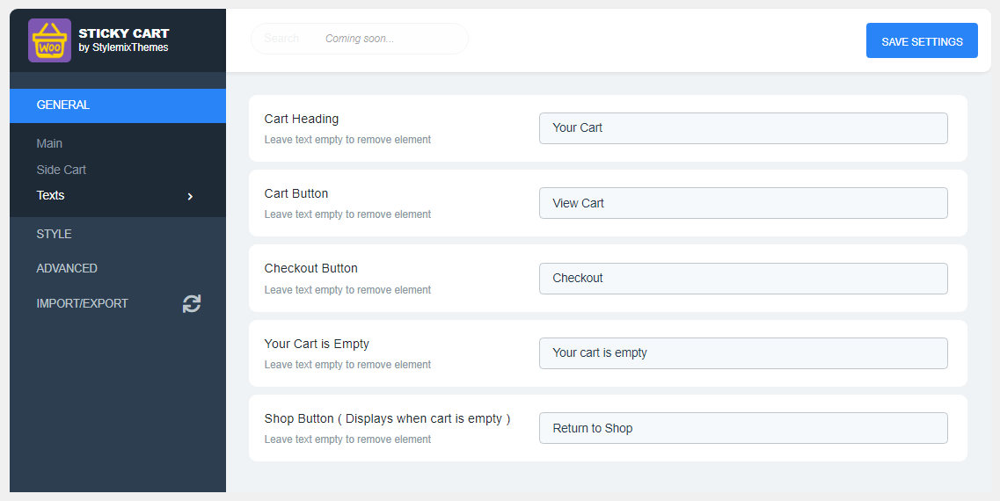

# Texts

**Texts** section includes the settings related to the text of the side cart elements. You can change the element's text or remove elements by leaving the field empty.

## Cart Heading

In this setting, you can specify the cart heading. The element will be removed by leaving this field empty.

.png>)

## Cart Button

In this setting, you can specify the footer cart button title. The element will be removed by leaving this field empty.

.png>)

## Checkout Button

In this setting, you can specify the footer checkout button. The element will be removed by leaving this field empty.

.png>)

## Your Cart is Empty

In this setting, you can specify the empty cart annotation text. The element will be removed by leaving this field empty.

.png>)

## Shop button

In this setting, you can specify the shop button title when no product has been added yet. The element will be removed by leaving this field empty.

.png>)
