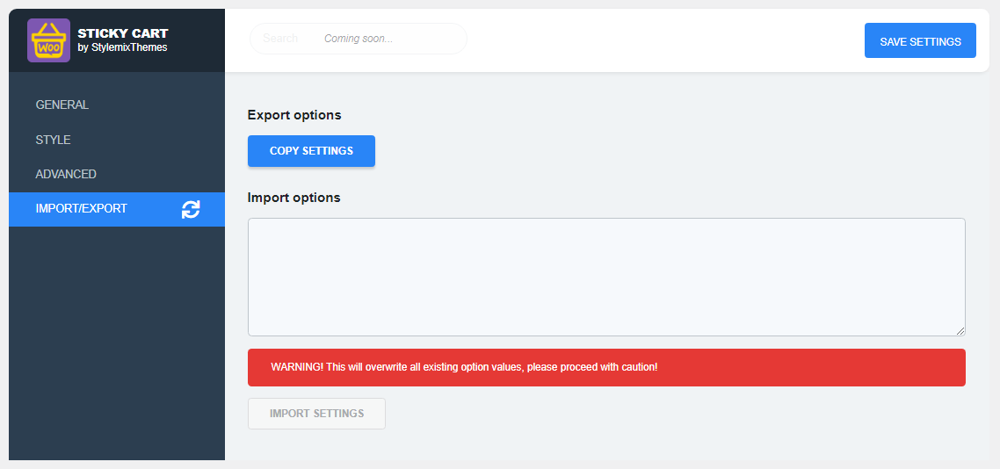

# Import & Export

## Import & Export settings

The **Import/Export** options allow to you apply the same settings configured on the plugin options setting on other your websites where the **Floating Sticky Cart** plugin is active.&#x20;

### Exporting settings

Click the **Copy Settings** button to export the settings. The settings will be copied to buffer:

.png>)

### Importing settings

To import the plugin exported settings, paste the copied settings on the **Import Options** area and click the **Import Settings** button. &#x20;

.png>)
