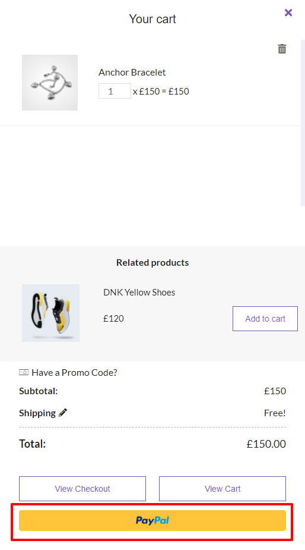

# PayPal

You can use one of the popular online payment gateways PayPal as a payment method for your products. In order to enable PayPal as a payment method go to WooCommerce Settings.

.png>)

On the opened page, go to the Payments section and install the PayPal extension.

.png>)


Follow the [documentation page](https://docs.woocommerce.com/document/woocommerce-paypal-payments/) of the PayPal extension for WooCommerce to get more information about payment gateway settings.


Afterward, you can connect your account to PayPal.

.png>)

Click the Connect to PayPal button which forwards you to the official PayPal webpage.

After connecting your account to PayPal, you can change the payment gateway settings in the Payments section of WooCommerce Settings.

.png>)

The PayPal payment option is available to use after saving changes.

